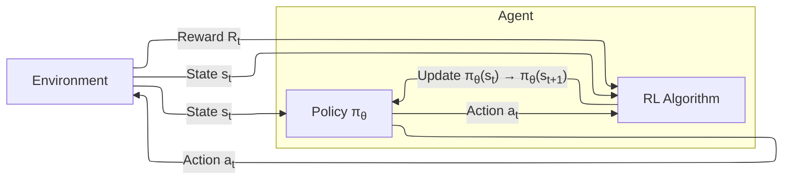
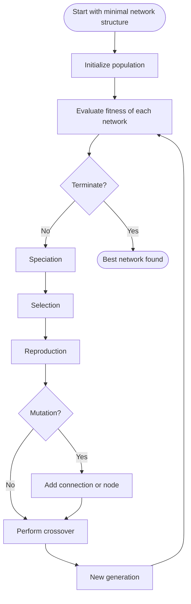

# Testing the NEAT Algorithm on a PSPACE-Complete Problem  

**Angel Marchev Jr.**, **Dimitar Lyubchev** and **Nikolay Penchev**  
 
 
 

  
*Acknowledgements - This work was financially supported by the UNWE Research Programme.*  
 
 
 
 
 

  
## Problem statement  
**Preamble:** stress on the need for architecture-independent methods by focusing in this paper on the NEAT (Neuro-Evolution of Augmenting Topologies) algorithm, as proposed by Stanley and Miikkulainen (2002)  
  
**Main objective:** Investigate the NEAT’s efficacy on a PSPACE-complete problem  
  
**Secondary objective:** study some of the characteristics and variations of the derived solution  
 
 
 
 
 

## Methodology for testing  

**API & Sokoban** - To simulate the PSPACE-complete problem, we utilized the gym-sokoban environment from the OpenAI Gym third-party environments.

**baseline models** - As a baseline model, we selected several popular Reinforcement Learning (RL) algorithms known for their applicability to similar types of problems.

**reproduce NEAT** - We reproduced the methodology outlined in Stanley and Miikkulainen’s original NEAT paper using the neat-python library.

**variations** - To thoroughly explore NEAT’s potential, we tested a wide range of configuration Variations: Initial Number of Nodes; Fitness Function Adaptation; Population Size and Generations; Mutation Rates; Training Environments; Network Types
 
**comparison** - The final step involved comparing the performance of NEAT against the baseline RL models. Key metrics included the number of iterations required to achieve success, the success rate, and the time per iteration.
 
 
 
 
 

## Sokoban problem definition
**Concept of zero-player games** - the agent (algorithm) interacts with the environment without human intervention.  

**Sokoban setup:**
- Objective: Push all boxes to target locations.
- Environment: A grid-based puzzle with walls, boxes, and targets.
- Challenges: Avoiding deadlocks and planning optimal moves.

**Computational complexity** 
- Sokoban is non-trivial puzzle:
  - high branching factor
  - numerous legal moves at each step
  - considerable search depth required

- Sokoban is P-space complete (Culberson, 1997; Hearn, 2006) - it can be solved using a memory amount that scales polynomially with the input length (polynomial space) - solving it would facilitate solving any other problem in PSPACE with relative ease

 
 
 
 
 

## Reinforcement Learning 
**Concept** - a type of machine learning where an agent learns to make decisions by taking actions in an environment to maximize cumulative rewards. Key components of RL include the agent, environment, states, actions, rewards, and policy.  
- Agent: The learner or decision maker.  
- Environment: Everything the agent interacts with.  
- State St at time t: A representation of the current situation of the environment  
- Action at at time t: A set of all possible moves the agent can make.  
- Reward Rt at time t: Feedback from the environment to evaluate the action taken.  
- Policy πθ parameterized by θ: The strategy that the agent employs to determine actions based on the current state.  
- Policy update process πθ(St) -> πθ(St + 1) from state St to St + 1: The implemented change in the policy reflecting the previous states and rewards.  

Fig. 1: Flowchart of the principal process of Reinforcement learning
 
 
 
 
 

## RL models used as baselines
**Q-learning** - is a value-based off-policy RL algorithm that aims to learn the value of the optimal policy independently of the agent’s actions. It updates the Q-values (quality of actions) iteratively using the Bellman equation:

$Q(s, a) \leftarrow Q(s, a) + \alpha [r + \gamma \max_a Q(s', a') - Q(s, a)]$

where α is the learning rate, γ is the discount factor, r is the reward, and s’ and a’ are the next state and action.

**Deep Q-Network (DQN)** extends Q-Learning by using deep neural networks to approximate the Q-values. This allows it to handle high-dimensional state spaces. DQN employs experience replay and target networks to stabilize training.

**Proximal Policy Optimization (PPO)** is a policy gradient method that aims to balance exploration and exploitation. It optimizes a surrogate objective function while ensuring that the new policy is not too far from the old policy to maintain stable learning:

$L^{\text{CLIP}}(\theta) = \mathbb{E}_t \left[ \min (r_t(\theta) \hat{A}_t, \text{clip}(r_t(\theta), 1 - \epsilon, 1 + \epsilon) \hat{A}_t) \right]$

where rt(θ) is the probability ratio and At is the advantage estimate.	

**Proximal Policy Optimization with Convolutional Neural Networks (PPO CNN)** is a variant of PPO that incorporates CNNs to extract features from high-dimensional input spaces, such as images. This is particularly useful for tasks involving visual data, where CNNs can effectively capture spatial hierarchies in the input.
 
 
 
 
 

## NEAT (Stanley, Miikkulainen, 2002)
**NeuroEvolution of Augmenting Topologies (NEAT)** evolves both neural network topologies and weights. NEAT enhances neuroevolution by optimizing and complexifying solutions incrementally. Each component (historical markings, speciation, minimal initial structure) is critical for efficient evolution, making NEAT a powerful approach for complex reinforcement learning tasks.

**genetic encoding** - Each genome in NEAT consists of a list of connection genes and node genes; 

**historical markings** - To perform crossover between diverse genomes, NEAT uses historical markings. Each new gene created by mutation is assigned a unique innovation number, which helps identify and match genes from different genomes, This avoids the problem of competing conventions and simplifies the crossover process.  

**speciation/innovation trade-off** - NEAT speciation protects structural innovations by allowing them to optimize without direct competition. Genomes are divided into species based on compatibility distance, ensuring diversity. Fitness sharing adjusts individual fitness by the number of species members, promoting niche preservation.  

**minimizing dimensionality** - starts with a minimal structure (no-hidden nodes) and grows only necessary structures through mutations.  
 
 
 
 
 

## NEAT Flowchart

 
 
 
 
 

## NEAT implementation
**Current encoding**

**each NEAT configuration** file involves parameters, grouped into several categories:
Algorithm (Hyper-) Parameters
Genome Parameters
Speciation Parameters
Stagnation Parameters
Reproduction Parameters

**Reward schedule**

| Reason                	| Reward |
| ------------------------- | ----:  |
| Perform Step          	| -0.1   |
| Push Box on Target    	|  1.0   |
| Push Box off Target   	| -1.0   |
| Push all boxes on targets | 10.0   |

Threshold : 10 / 7
 
 
 
 
 

## Experiment design table

 
 
 
 
 

## Experiment result table

| algo | variant  | iters | success | time/iter |
|------|----------|-------|---------|-----------|
| RL   | DQN  	| 5000  | No  	| 45    	|
| RL   | PPO  	| 5000  | No  	| 26    	|
| RL   | PPO opt  | 5000  | No  	| 29    	|
| RL   | PPO CNN  | 5000  | No  	| 27    	|
| RL   | Q-learn  | 1000  | Yes 	| 23    	|
| NEAT | config 1 | 1000  | Yes 	| 11    	|
| NEAT | config 2 | 1000  | No  	| 14    	|
| NEAT | config 3 | 1000  | No  	| 13    	|
| NEAT | config 4 | 1000  | No  	| 15    	|
| NEAT | config 5 | 1000  | No  	| 16    	|
| NEAT | config 6 | 1000  | No  	| 17    	|

 
 
 
 
 

## Key findings
**solvability** - NEAT was able to successfully solve the Sokoban problem within 1000 iterations (20 generations), outperforming traditional reinforcement learning (RL) algorithms such as DQN, PPO, and their variants, underscoring Testing the NEAT Algorithm on a PSPACE-Complete Problem without predefined network architecture.  

**variations of configurations** - Through various tests with different configuration setups, we found:  
– Customizing Fitness: Customizing the fitness function improved the learning process.  
– Feedforward vs. Recurrent: No significant difference was observed between feedforward and recurrent networks (feedforward=False) for Sokoban during the first 50 generations with a population of 500.  
– Species Influence: The number of species greatly influences behavior:  
  • Higher number of hidden nodes (and layers) proportionally increases the number of species.  
  • More hidden nodes lead to greater diversity and a higher chance of improving fitness scores and finding optimal solutions.  

**software implementation** - critical insights from neat-python library:   
– Speciation:  
  • Each species is assigned a fitness score, typically the average fitness of its members.  
  • Speciation allows search to proceed in multiple spaces simultaneously.  
  • Without speciation, structural innovations do not survive, and the population quickly converges on initially well-performing topologies.  
– Fitness Sharing: Reduces the fitness of similar individuals within a species to encourage diversity and prevent any single individual from dominating.  
– Selection:  
  • Parents are selected based on their fitness, with fitter individuals having a higher selection probability.  
  • Stochastic Universal Sampling (SUS): Ensures a more even distribution of offspring among individuals according to their fitness.  
  • Neat-python uses a replacement strategy based on stagnation (after certain number of generations)  
– Mutation:  
  • Direct influence on parameters such as weights, biases, number of nodes, and connections.  
  • Cannot directly influence actions taken at each step (this was additionally implemented by us).  
– Technical limitations: Scaling the solution is limited to CPU optimizations due to the nature of the neat-python and gym-sokoban libraries.  

**Future work** - Future goals for this research include exploring custom neuro-evolutionary architecture search, which involves developing different genome structures and initialization methods. Additionally, improving the crossover mechanisms and initial hyperparameter optimization are key areas of focus.
 
 
 
 
 

## References
1. Stanley, K.O., Miikkulainen, R.: Efficient evolution of neural network topologies. In: Proceedings of the 2002 Congress on Evolutionary Computation. CEC’02 (Cat. No.02TH8600), vol. 2, pp. 1757–1762. IEEE, Honolulu (2002). https://doi.org/10.1109/CEC.2002.1004508
2. Schulman, J., Wolski, F., Dhariwal, P., Radford, A., Klimov, O.: Proximal Policy Optimization Algorithms. arXiv preprint arXiv:1707.06347 (2017). https://doi.org/10.48550/arXiv.1707.06347
3. McIntyre, A.: NEAT-Python 0.92 documentation (2019). CodeReclaimers, LLC. Accessed July 1, 2024. https://neat-python.readthedocs.io/en/latest/neat_overview.html
4. Fryers, M., Greene, M.: Sokoban. Eureka 54, 25–32 (1995)
5. Dor, D., Zwick, U.: SOKOBAN and other motion planning problems. Computational Geometry 13(4), 215–228 (1999). https://doi.org/10.1016/S0925-7721(99)00017-6
6. Culberson, J.C.: Sokoban is PSPACE-complete. Technical Report TR 97-02, Dept. of Computing Science, University of Alberta (1997)
7. Hearn, R.A.: Games, Puzzles, and Computation. PhD thesis, Massachusetts Institute of Technology, pp. 98–100 (2006)
8. Junghanns, A., Schaeffer, J.: Sokoban: Improving the Search with Relevance Cuts. Theoretical Computer Science 252(1-2), 5–19 (2001). https://doi.org/10.1016/S0304-3975(00)00080-3
9. Holland, D., Shoham, Y.: Theoretical analysis on Picokosmos 17. Archived from the original on 2016-06-07
10. Junghanns, A., Schaeffer, J.: Sokoban: Evaluating standard single-agent search techniques in the presence of deadlock. Theoretical Computer Science 252(1-2), 4–19 (1998)
11. Virkkala, T.: Solving Sokoban. MSc thesis, University of Helsinki, p. 1 (2011)
12. Junghanns, A., Schaeffer, J.: Sokoban: Enhancing general single-agent search methods using domain knowledge. Artificial Intelligence 129(1-2), 219–251 (2001). https://doi.org/10.1016/S0004-3702(01)00109-6
13. Shoham, Y., Schaeffer, J.: The FESS Algorithm: A Feature Based Approach to Single-Agent Search. In: 2020 IEEE Conference on Games (CoG), pp. 1–8. IEEE, Osaka (2020). https://doi.org/10.1109/CoG47356.2020.9231929
14. Damgaard, B. (2024, June 4). Open Test Suite - Numbers. Sokoban Solver Statistics. Retrieved from https://sokoban-solver-statistics.sourceforge.io/statistics/OpenTestSuite/Numbers.html
 
 
 
 
 

## The Solutions

